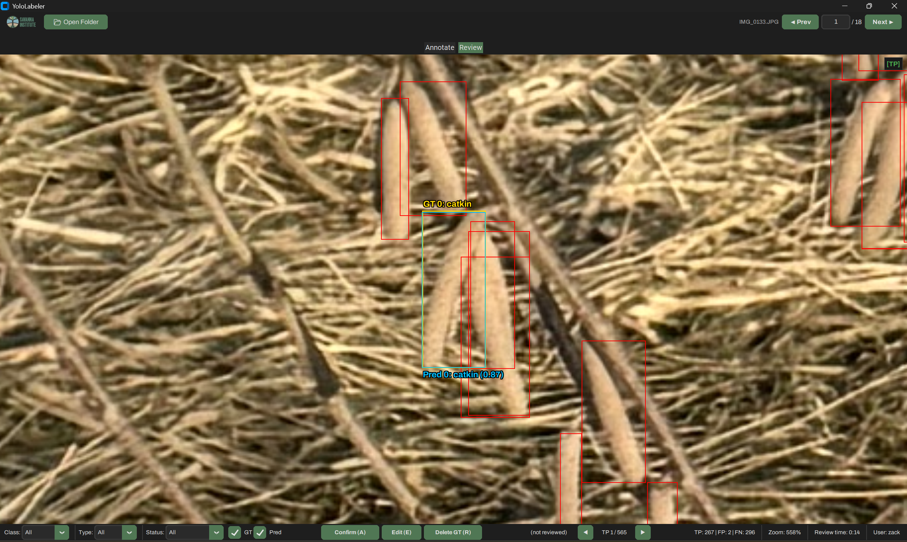

# YoloLabeler

Desktop tool for drawing and reviewing YOLO bounding-box and instance-segmentation
annotations, and for visualizing model predictions against ground truth.
Built with Python + CustomTkinter; no GPU, no server, no browser required.


---

## Install

```bash
pip install git+https://github.com/ZackLoken/yolo-annotator.git
```

Or for development:

```bash
git clone https://github.com/ZackLoken/yolo-annotator.git
cd yolo-annotator
pip install -e .
```

### Requirements

- Python 3.9+
- Pillow ≥ 9.0
- CustomTkinter ≥ 5.0
- Shapely ≥ 2.0

---

## Usage

**Launch the GUI:**

```bash
yololabeler
```

A folder dialog will open — select a folder of images.

**Or pass a folder directly:**

```bash
yololabeler /path/to/images
```

**Or run as a module:**

```bash
python -m yololabeler /path/to/images
```


---

## Controls

### Annotate tab

| Action                       | Input                    |
|------------------------------|--------------------------|
| Toggle Box / Polygon mode    | `m`                      |
| Toggle vertex streaming      | `v`                      |
| Toggle vertex snapping       | `s`                      |
| Select class by id           | `0`–`9`                  |
| Undo                         | `Ctrl+Z`                 |
| Redo                         | `Ctrl+Y`                 |
| Toggle help overlay          | `h`                      |
| Cancel / Deselect polygon    | `Escape`                 |
| Next / Previous image        | `→` / `←`                |
| <div align="center">**Box mode**</div> | |
| Draw a box                   | Left-click + drag        |
| Delete a box                 | Right-click on box       |
| <div align="center">**Polygon mode**</div> | |
| Place vertex                 | Left-click               |
| Select polygon               | Left-click on polygon    |
| Close polygon                | Double-click             |
| Move vertex                  | Drag vertex (selected)   |
| Insert vertex on edge        | Click edge (selected)    |
| Delete vertex                | Right-click vertex       |
| Delete polygon               | Right-click in polygon   |
| <div align="center">**Navigation & view**</div> | |
| Pan up / down                | Scroll                   |
| Pan left / right             | Shift + Scroll           |
| Zoom at cursor               | Ctrl + Scroll            |
| Pan (free)                   | Middle-click + drag      |

### Review tab

| Action                        | Input  |
|-------------------------------|--------|
| Accept detection              | `a`    |
| Reject detection              | `r`    |
| Edit detection (→ Annotate)   | `e`    |
| Previous / Next detection     | `←` / `→` |
| Next / Previous image         | `↑` / `↓` |
| Toggle Box / Polygon mode     | `m`    |
| Toggle help overlay           | `h`    |

Press `h` in either tab for a full keybinding reference including per-action
behavior for FP / FN / TP detections.

---

## Folder Structure

```
images/
├── img001.jpg
├── img002.jpg
├── state/
│   ├── annotation_stats.json
│   ├── review_stats.json
│   └── classes.json
├── labels/
│   ├── detect/
│   │   ├── img001.txt          # bounding boxes (YOLO format)
│   │   └── img002.txt
│   └── segment/
│       ├── img001.txt          # polygon masks (YOLO format)
│       └── img002.txt
└── predictions/
    ├── detect/
    │   ├── img001.txt          # model-predicted boxes
    │   └── img002.txt
    └── segment/
        ├── img001.txt          # model-predicted polygons
        └── img002.txt
```

---

## Output Formats

### YOLO `.txt` — separate directories for training compatibility

Annotations are saved to two subdirectories so each is directly compatible with
Ultralytics `yolo detect train` and `yolo segment train`.

**Detection** (`labels/detect/`):

```
<class_id> <x_center> <y_center> <width> <height>
```

**Segmentation** (`labels/segment/`):

```
<class_id> <x1> <y1> <x2> <y2> ... <xN> <yN>
```

All values are **normalized to 0–1** relative to image dimensions.

### Predictions (for review)

Place model prediction files in `predictions/detect/` and `predictions/segment/`
using the same YOLO format with an added confidence score:

**Detection**: `<class_id> <confidence> <x_center> <y_center> <width> <height>`

**Segmentation**: `<class_id> <confidence> <x1> <y1> ... <xN> <yN>`

The Review tab matches predictions against ground truth using IoU (default 0.60)
to classify each as TP, FP, or FN.

### `classes.json`

When you add classes via the toolbar, a `classes.json` file is saved in the image
folder. This file stores class names and colors and is automatically loaded on
next launch.

```json
{
  "0": {"name": "catkin", "color": "#e6194b"},
  "1": {"name": "bud", "color": "#3cb44b"}
}
```

---

## Features

### Annotate tab


- **Box + Polygon modes:** toggle with `m` key or toolbar button
- **Vertex streaming:** continuous vertex placement while moving the mouse (`v` to toggle)
- **Edge snapping:** snap to nearby polygon edges while streaming (`s` to toggle)
- **Polygon selection:** click a polygon to select it for editing; Escape to deselect
- **Full vertex editing:** drag, insert on edge, right-click delete (on selected polygon)
- **Snapshot undo / redo:** `Ctrl+Z` / `Ctrl+Y` for any mutation
- **Multi-class support:** dropdown selector + inline "Add" for new classes, per-class colors
- **Completion tracking:** mark images as complete; filter by status
- **Annotation stats:** per-image and per-session timing, annotation counts (`annotation_stats.json`)
- **Separate label dirs:** `labels/detect/` and `labels/segment/` for clean Ultralytics training
- **Dynamic symbology:** line widths, vertex sizes, and labels scale with zoom level
- **Text halo:** annotation labels use dark outlines for readability on any background
- **Fit-to-view:** auto-fits image on open and window resize
- **EXIF orientation:** auto-corrects rotated phone photos
- **Viewport cropping:** only renders the visible region, safe at any zoom level
- **Save on navigate:** annotations are saved when you change images, quit, or close

### Review tab



- **IoU-based matching:** automatically matches predictions to ground truth (IoU ≥ 0.60)
- **Detection cycling:** step through FP / FN / TP detections with auto-zoom
- **Accept / Reject / Edit:** per-detection actions with type-specific behavior
- **Prediction reference overlay:** dashed blue overlay shows prediction geometry while editing
- **Viewport sync:** zoom and position carry over between Annotate and Review tabs
- **Review state persistence:** progress saved to `review_stats.json`, survives across sessions
- **Review timer:** tracks time spent reviewing per image
- **Original label backup:** `.original/` copies made before first destructive edit

---

## Review Mode

The Review tab compares model predictions against ground-truth annotations and steps you through each mismatch so you can confirm, correct, or dismiss it.

### Entering Review mode

Click the **Review** tab at the top of the window. On first switch the tool finds the first image that has a prediction file, runs IoU matching, and auto-zooms the canvas to the first unreviewed detection. Switching back to the Annotate tab preserves the zoom level and image position.

### Prediction files

Place model output files in the `predictions/` subdirectory of your image folder, named identically to the corresponding image (same stem, `.txt` extension):

```
predictions/
├── detect/
│   └── img001.txt    # one prediction per line
└── segment/
    └── img001.txt    # one prediction per line
```

The expected line formats are documented in [Output Formats](#output-formats) above. Any image that has no prediction file in either directory is excluded from the Review image list. Class IDs present in prediction files but absent from `classes.json` are added to the class list automatically.

### IoU-based matching

When an image is loaded for review, every prediction above the confidence threshold (default **0.50**) is matched against ground-truth annotations of the same class. All candidate GT-prediction pairs are scored by IoU and assigned greedily, highest-IoU first, so each GT and each prediction participates in at most one match.

| Classification | Condition |
|----------------|-----------|
| **TP** (true positive) | Prediction matched to a GT annotation (IoU ≥ **0.60**, same class) |
| **FP** (false positive) | Prediction not matched to any GT annotation |
| **FN** (false negative) | GT annotation not matched by any prediction |

TP/FP/FN counts for the current image are shown in the toolbar. The focused GT annotation is drawn in gold; other GT annotations appear in their class color; the focused prediction is drawn in blue. Detections that have already been reviewed are rendered with a translucent stipple fill.

### Accept / Reject / Edit actions

The three actions behave differently depending on detection type:

| Action | TP | FP | FN |
|--------|----|----|----|
| **Accept** (`a`) | **Confirm** — record accepted, advance to next detection (GT unchanged) | **Add to GT** — switch to Annotate tab with prediction shown as dashed blue reference so you can draw a new GT annotation | **Keep GT** — record accepted, advance to next detection (GT unchanged) |
| **Reject** (`r`) | **Delete GT** — remove the matched GT annotation from the label file, recompute matches | **Dismiss** — record rejected, advance to next detection (no disk change) | **Delete GT** — remove the GT annotation from the label file, recompute matches |
| **Edit** (`e`) | Switch to Annotate tab with prediction shown as dashed blue reference for editing the existing GT annotation | Switch to Annotate tab with prediction shown as dashed blue reference | Switch to Annotate tab with prediction shown as dashed blue reference |

When an Edit or FP Accept switches you to the Annotate tab, draw or adjust the annotation normally. Pressing `Escape` to deselect the polygon triggers a confirmation dialog — click **Accept** to save the changes and return to the Review tab, or **Redo** to undo the last edit and try again.

### Stepping through detections

| Action | Input |
|--------|-------|
| Next / Previous detection | `→` / `←` |
| Next / Previous image | `↑` / `↓` |

The canvas auto-zooms so the focused detection occupies roughly one-third of the viewport. After each action the tool advances automatically to the next unreviewed detection. When all detections on an image have been reviewed the tool moves to the next image in the review list.

Use the status-bar dropdowns to narrow what is shown:

| Dropdown | Options |
|----------|---------|
| **Class** | All · per-class filter |
| **Type** | All · FP · FN · TP |
| **Status** | All · Not Reviewed · Reviewed |

The **GT** and **Pred** checkboxes toggle visibility of ground-truth and prediction overlays independently.

### Output

| File / Location | Content |
|-----------------|---------|
| `state/review_stats.json` | Per-detection records: match type, action, class, normalized bbox, IoU, confidence, and reviewer name |
| `labels/detect/` and `labels/segment/` | Updated in-place when a GT annotation is deleted (Reject on TP or FN) or a new annotation is accepted (Accept on FP via the Annotate tab) |
| `labels/detect/.original/` and `labels/segment/.original/` | One-time backup of all label files, created automatically before the first destructive edit in a review session |

---

## Authors

Zack Loken

---

## License

[MIT](LICENSE)
